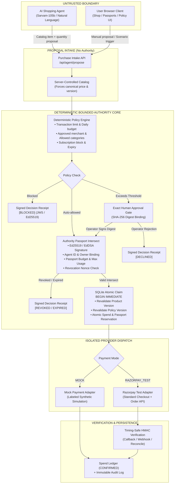

# BoundPay

BoundPay demonstrates bounded financial authority for agentic commerce. A model or fixture may propose one catalog item, but it cannot set prices, approve a purchase, reserve budget, create a provider order, or confirm payment. Those operations remain in deterministic server services backed by SQLite.

This repository is a buildathon evaluation build, not a production payment product. Its scope is one operator, one approved merchant, INR integer-paise accounting, one application instance, Sarvam AI (sarvam-105b) proposal selection, and Razorpay Standard Checkout in TEST mode.

## Architecture & Trust Boundaries



### Authorization & Execution Lifecycle

| Step | Stage | Authority Rule & Invariant | Output State |
| :---: | :--- | :--- | :--- |
| **1** | **Proposal Intake** | Model or user proposes product & quantity. Server strictly resolves canonical price & version from server catalog. | Proposal Created (`READY` / `NEEDS_APPROVAL`) |
| **2** | **Policy Gate** | Evaluates integer-paise caps, daily budget, merchant allowlist, category, and subscription ban. | Auto-Allowed or Blocked (`BLOCKED`) |
| **3** | **Human Approval** | Required if amount exceeds approval threshold. Bound cryptographically to SHA-256 digest of exact proposal. | Approved Intent (`APPROVED`) |
| **4** | **Passport Gate** | Intersects policy with Ed25519 Authority Passport. Enforces agent bounds, quota, budget, and revocation nonce. | Validated Authority Mandate |
| **5** | **Atomic Claim** | SQLite `BEGIN IMMEDIATE` revalidates catalog & policy versions; locks daily budget and passport allowance atomically. | Intent Claimed (`EXECUTING`) |
| **6** | **Provider Dispatch** | Isolated route to either MOCK adapter or Razorpay TEST gateway (`createOrder`). | Order Created (`ORDER_CREATED`) |
| **7** | **Settlement & Audit** | Timing-safe HMAC callback/webhook verification. Appends to immutable audit trail. | Confirmed Ledger (`PAYMENT_CONFIRMED`) |


## What is implemented


- Server-owned, versioned catalog and spending policy.
- Explicit per-purchase budget and deterministic transaction, category, merchant, subscription, expiry, and daily-budget checks.
- Stale catalog regression guard: durably invalidates proposals if the catalog price or attributes advance before checkout, transitioning to `EXPIRED` and preserving financial isolation.
- Human approval bound to the SHA-256 digest of exact product, quantity, price, budget, policy/catalog versions, owner, merchant, and quote expiry.
- Atomic SQLite `BEGIN IMMEDIATE` reservation before provider dispatch; one ledger row per intent.
- Idempotent intent/order behavior, durable `UNKNOWN` outcomes, receipt/status reconciliation, signed callback and webhook verification, webhook replay handling, and append-only application audit export.
- Clearly separated `FIXTURE`/`LIVE_MODEL` proposal modes and `MOCK`/`RAZORPAY_TEST` payment modes.
- Authenticated scenario controls that modify normal inputs or inject mock faults at adapter boundaries; they never set a final decision.
- Clean, modern enterprise UI across all views (`/shop`, `/login`, `/policy`, `/activity`, `/passports`) featuring refined typography, dark glassmorphism navigation, responsive mobile layouts, and a visual authorization debugger.
- Versioned Authority Passports: immutable Ed25519/EdDSA-signed, owner/agent-bound mandates with durable revocation, explicit merchant/category/amount/budget/usage constraints, and an atomic passport-usage ledger.
- Signed authorization decision receipts for every deterministic outcome, offline verification/proof bundles, and a keyboard-operable visual authorization debugger.

See [Architecture](docs/ARCHITECTURE.md), [Authority Passports](docs/AUTHORITY_PASSPORTS.md), [Passport Threat Model](docs/AUTHORITY_PASSPORT_THREAT_MODEL.md), [Threat Model](docs/THREAT_MODEL.md), [Evaluation](docs/EVALUATION.md), [Phase 4 Report](docs/PHASE_4_REPORT.md), [Razorpay Test Verification](docs/PHASE_4_RAZORPAY_TEST_VERIFICATION.md), and [Final Security Verification](docs/FINAL_SECURITY_VERIFICATION.md).

## Requirements & Prerequisites

Also documented in [requirements.txt](requirements.txt) and [package.json](package.json).

| Component | Requirement | Tested Version | Notes |
| :--- | :--- | :--- | :--- |
| **Node.js** | `>= 20.0.0` (LTS) | `v20.20.2` | Core JavaScript runtime |
| **Package Manager** | `pnpm >= 10.0.0` | `10.33.0` | Dependency resolution via `pnpm-lock.yaml` |
| **Database** | SQLite 3 with WAL support | `better-sqlite3 11.8.1` | Local persistent file storage (`DATABASE_PATH`) |
| **Operating System** | Linux, macOS, or Windows (WSL2) | Ubuntu Linux x64 | Requires POSIX-compliant filesystem for SQLite locks |
| **Browser Engine** | Chromium | Installed via Playwright | Required for running `pnpm run test:e2e` |
| **Cryptography** | Node `crypto` + `jose 6.2` | Built-in / `jose 6.2.11` | Ed25519 / EdDSA Authority Passport signatures |
| **Live Model (Optional)** | `SARVAM_API_KEY` | `sarvam-105b` | Required only when `AGENT_MODE=live` (offline fixtures require no key) |
| **Payment Gateway (Optional)** | `RAZORPAY_KEY_ID`, `_SECRET` | TEST mode (`rzp_test_*`) | Required only when `PAYMENT_ADAPTER_MODE=RAZORPAY_TEST` |

## Setup

```bash
cp .env.example .env
pnpm install --frozen-lockfile
pnpm run db:migrate
pnpm run db:seed
pnpm run dev
```

Open `http://localhost:3000`. Local seed credentials are `operator` / `BoundPayPass123!`; replace `OPERATOR_INITIAL_PASSWORD` and `SESSION_SECRET` before any shared deployment.

Important environment values:

- `DATABASE_PATH`: persistent SQLite file path.
- `AGENT_MODE=fixture|live`; live requires `SARVAM_API_KEY` (model `sarvam-105b` via `/v1/chat/completions`) or optional `OPENAI_API_KEY`.
- `PAYMENT_ADAPTER_MODE=MOCK|RAZORPAY_TEST`; Razorpay TEST requires test key ID/secret and webhook secret. `rzp_live_` keys are rejected.
- `QUOTE_VALIDITY_SECONDS`: exact-intent quote lifetime.
- `AUTHORITY_SIGNING_PRIVATE_KEY` / `_FILE`: server-only Ed25519 PKCS#8 signing key. `AUTHORITY_SIGNING_PUBLIC_KEY` / `_FILE`, `AUTHORITY_SIGNING_KEY_ID`, `AUTHORITY_ISSUER`, and `AUTHORITY_AUDIENCE` are required for a configured non-test authority. Use `pnpm run authority:keys` for local files under ignored `.authority/`; never commit or log them.
- `AUTHORITY_VERIFICATION_KEYS_JSON`: optional `kid` → public-key map for verification-key rotation. Unknown key IDs and unsupported algorithms fail closed. `AUTHORITY_TEST_MODE=true` is deterministic and test-only.

Live mode never silently falls back to fixtures. Existing intents retain the adapter mode they were created with.

## Demo

Use the “Authenticated demo scenario runner” on Shop and follow [docs/DEMO_SCRIPT.md](docs/DEMO_SCRIPT.md). Reset first for a predictable local demo:

```bash
CONFIRM_RESET=true pnpm run db:reset
pnpm run build
pnpm start
```

A genuine Razorpay TEST demonstration still requires the operator to supply credentials, configure a reachable signed webhook, complete Checkout, and capture matching dashboard evidence. Do not present a mock confirmation as that evidence.

## Verification commands and current evidence

```bash
pnpm run typecheck
pnpm run lint
pnpm test
pnpm run test:deterministic
pnpm run test:state
pnpm run test:e2e
pnpm run build
pnpm run eval:latency
pnpm audit --prod
pnpm run authority:validate
pnpm run security:public-artifacts
```

Final verification status (release tag `boundpay-buildathon-final`):
- **Vitest**: **338/338 tests passed** across 29 files, covering Authority Passports, Ed25519/EdDSA crypto, deterministic policy evaluation, worker-process SQLite concurrency/locking, schema migrations, and stale historical-catalog regression guards.
- **Playwright E2E**: **18/18 Chromium tests passed** across all user scenarios, unauthenticated route protection, operator login, human approval flows, Visual Authorization Debugger inspection, receipt verification, and passport lifecycle.
- **TypeScript**: `tsc --noEmit` passed with 0 errors.
- **ESLint**: `next lint` passed with 0 warnings and 0 errors.
- **Public Secret Exposure**: `pnpm run security:public-artifacts` scanned 94 static/server client-facing build artifacts and confirmed 0 private keys, secrets, or tokens exposed.
- **Fresh Clone Verification**: Documented setup (`cp .env.example .env`, `pnpm install`, `pnpm run db:migrate`, `pnpm run db:seed`, `pnpm run build`) verified clean from an isolated clone.

Live model evaluation (Sarvam AI sarvam-105b): 20/20 executed, 0 skipped. Strict JSON Schema output verified with Zod business validation. 19/20 requests satisfied, 2 proposed policy violations (subscriptions) both strictly blocked by the deterministic policy gate, 0 unexpected payment provider order calls, median latency 6929 ms.

Real Razorpay TEST verification: Phase 4 completed full end-to-end verification with test credentials (live Sarvam proposal, exact human approval, order `order_TYFC3NA5M8g7qI`, payment `pay_TYFqxNNBrbJRas`, ₹2,799 captured, 1 confirmed ledger row, timing-safe HMAC signature verified, authoritative provider lookup confirmed). Razorpay Test Dashboard record confirmed by operator. See [docs/PHASE_4_RAZORPAY_TEST_VERIFICATION.md](docs/PHASE_4_RAZORPAY_TEST_VERIFICATION.md) and [docs/FINAL_SECURITY_VERIFICATION.md](docs/FINAL_SECURITY_VERIFICATION.md).

## Deployment preparation

Build with `pnpm run build` and run with `pnpm start`. Deploy exactly one application instance with a persistent volume mounted at `DATABASE_PATH`; SQLite file locks and the in-process mock adapter are not a multi-instance design. Use HTTPS, strong environment-only secrets, `Secure` cookies (`NODE_ENV=production`), and a public HTTPS Razorpay webhook URL. Run migrations before start and back up the persistent volume. Re-run auth, webhook, payment, and browser smoke tests in the deployed environment.

No deployment or publication is performed by repository scripts.

## Authority Passport quick start

The `/passports` view issues and revokes owner-bound passports. Each new intent selects exactly one ACTIVE passport; omitted passport IDs in legacy Phase 3 service calls resolve to the seeded OfficeBot demo passport for compatibility. Passport constraints only intersect with (and can never widen) the current server policy. `UNKNOWN`, `COMMITTED`, and `CONFIRMED` usage rows continue consuming the passport budget and usage allowance; only a definite provider rejection releases a reservation.

Decision receipts are signed EdDSA compact JWS statements, not payment receipts and not execution capabilities. `/api/intents/:id/proof` downloads a sanitized receipt/passport/JWK/fingerprint bundle. Offline verification proves that the configured BoundPay authority signed unchanged contents; it does not prove database completeness, host integrity, or bank settlement. See [docs/AUTHORITY_PASSPORTS.md](docs/AUTHORITY_PASSPORTS.md) and [docs/DEMO_SCRIPT.md](docs/DEMO_SCRIPT.md).

## Limitations

- One operator, one approved merchant, one currency, and one application instance.
- No claim of power-loss or storage-corruption durability.
- The audit is append-only through the application, not tamper-proof against a database administrator.
- The policy gate constrains explicit attributes; a model can still make an undesirable choice that technically satisfies policy.
- The live-model set is small and currently unexecuted; it cannot establish general prompt-injection immunity.
- Browser automation does not complete third-party Razorpay Checkout.
- Authority signing is intentionally single-authority and single-operator in this phase; key rotation is verification-key (`kid`) support, not a multi-organization trust system.

## AI coding-tool disclosure

Codex was used to inspect, implement, test, and draft Phase 3 artifacts. Human review is still required for credentials, actual provider/dashboard evidence, live-model result interpretation, deployment configuration, and final claim wording. Generated claims were checked against command output and machine-readable artifacts rather than treated as evidence by themselves.
