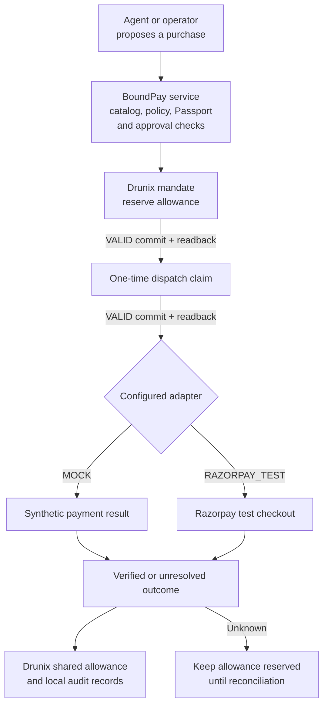

# BoundPay: Shared Spending Authority for AI Agents

BoundPay is a prototype for giving AI agents bounded purchasing authority across multiple checkout services. It combines signed spending mandates, deterministic policy checks, human approval, and a shared allowance recorded by a permissioned Drunix ledger.

The model can propose a purchase, but it cannot set the catalog price, approve a transaction, reserve funds, or confirm an outcome. BoundPay services apply those controls before any configured payment adapter is called.

## Submission overview

An agent can stay within a local spending limit and still overspend when two separate services each see enough local headroom. A second problem occurs when a payment request times out: the service cannot safely treat a missing response as proof that no payment happened.

BoundPay addresses these cases with a signed Authority Passport and a narrower shared mandate. Participating services reserve against one Drunix allowance. A service may dispatch only after the reservation and one-time dispatch claim have both committed as `VALID` and their state has been read back. Unknown payment outcomes keep the allowance reserved until reconciliation.

In the recorded local demonstration, two INR 2,799 requests competed for a INR 5,000 shared allowance. One request was confirmed by the synthetic MOCK adapter; the other was blocked. The two organizations used the Drunix sample network on one developer-controlled host. The demonstration did not contact a payment provider or move funds.

## How it works


```mermaid
flowchart TD
    Proposal["Agent or operator<br/>proposes a purchase"] --> Local["BoundPay service<br/>catalog, policy, Passport<br/>and approval checks"]
    Local --> Reserve["Drunix mandate<br/>reserve allowance"]
    Reserve -->|VALID commit + readback| Claim["One-time dispatch claim"]
    Claim -->|VALID commit + readback| Payment{"Configured adapter"}
    Payment -->|MOCK| Mock["Synthetic payment result"]
    Payment -->|RAZORPAY_TEST| Razorpay["Razorpay test checkout"]
    Mock --> Outcome["Verified or unresolved outcome"]
    Razorpay --> Outcome
    Outcome --> Ledger["Drunix shared allowance<br/>and local audit records"]
    Outcome -->|Unknown| Hold["Keep allowance reserved<br/>until reconciliation"]
```

The shared contract validates participant identity, mandate scope and limits, reservation uniqueness, revocation, and outcome permissions. The application also applies its existing deterministic policy and exact human-approval gate. A committed revocation prevents new reservations; it does not cancel a payment already dispatched.

The contribution is an integrated BoundPay and Drunix prototype with commit-checked dispatch and recovery for uncertain outcomes. Shared spending limits and held reservations have prior art; this project does not claim a new or first authorization primitive. The design rationale and comparison with related work are in the [Phase 2 implementation report](docs/DRUNIX_PHASE2_IMPLEMENTATION.md#distinctive-contribution-and-prior-work).

## Prototype scope

The branch adds a Go chaincode contract, a Node Gateway client, a shared mandate and reservation flow, a durable dispatch and recovery outbox, and the `/shared-authority` view. It builds on BoundPay’s existing controls:

- Server-owned catalog prices and deterministic transaction, merchant, category, subscription, expiry, and daily-budget checks.
- Human approval bound to the exact purchase details.
- Ed25519-signed, owner- and agent-bound Authority Passports with amount, budget, usage, and revocation limits.
- Atomic SQLite reservations for each service’s local state.
- Explicit `MOCK` and `RAZORPAY_TEST` payment modes, signed decision receipts, audit records, and reconciliation flows.

For a single trusted operator, one SQLite database is simpler and faster. A shared ledger is useful when separately governed participants need to enforce and inspect a common allowance. The local sample demonstrates separate identities and services, but both organizations run on one developer-controlled host; it does not demonstrate independent organizational governance.

## Run the BoundPay application

### Requirements

- Node.js 20 or later and pnpm 10 or later.
- Chromium installed through Playwright to run the browser suite.
- Docker, Go 1.23, and the pinned Drunix v1.0.0 source and toolchain to run the shared-ledger demonstration.

The application was verified with Node.js `20.20.2`, pnpm `10.33.0`, Drunix `v1.0.0`, and Go `1.23.0`. See the [Phase 2 runbook](docs/DRUNIX_PHASE2_IMPLEMENTATION.md#drunix-source-versions-and-deployment) for pinned images and network requirements.

Install Chromium before running the browser suite:

```bash
pnpm exec playwright install chromium
```

### Local setup

```bash
cp .env.example .env
pnpm install --frozen-lockfile
pnpm run authority:keys
pnpm run db:migrate
pnpm run db:seed
pnpm run dev
```

Open `http://localhost:3000`. The seeded local operator is `operator` with the default password configured by `OPERATOR_INITIAL_PASSWORD`; change both that password and `SESSION_SECRET` before any shared deployment. Generate the local signing keys before seeding so the demo Authority Passport can be issued. The standalone CLI loads `.env.local` before `.env`, while values already set in the process environment take precedence.

The default environment uses fixture proposals and the labeled `MOCK` adapter. Live model proposals require `SARVAM_API_KEY` (or the optional OpenAI provider configuration). Razorpay requires test credentials and `PAYMENT_ADAPTER_MODE=RAZORPAY_TEST`; live Razorpay keys are rejected. See [.env.example](.env.example) for configuration.

### Run the demo

For the single-service application, use the authenticated scenario runner on `/shop` and follow the [demo script](docs/DEMO_SCRIPT.md).

For the two-service Drunix demonstration, first prepare the pinned network and deploy the chaincode using the [Phase 2 runbook](docs/DRUNIX_PHASE2_IMPLEMENTATION.md#reproduce-the-local-network-and-chaincode). Then run:

```bash
pnpm run build
pnpm run shared-authority:drunix-demo
pnpm run shared-authority:drunix-app-demo
```

The app demo starts two production-mode BoundPay services with separate SQLite files and Drunix identities. It exercises competing reservations, restart recovery, an unknown payment result, and a pre-dispatch ledger outage. Its payment adapter is MOCK. The demo does not evidence Razorpay settlement or a bank transfer. Set `DRUNIX_DEMO_REVIEW_SECONDS=90` before the app-demo command to leave the local dashboards open for review.

## Verification

The working tree was verified on 2026-09-29:

| Check | Result |
| --- | --- |
| Vitest | 347/347 tests passed across 32 files. |
| Playwright | 18/18 Chromium scenarios passed using MOCK payments. |
| Concurrency stress | 7/7 tests passed in the dedicated 25-round worker-process run. |
| Go chaincode | `go test -mod=vendor -race -count=1 ./...` passed in the pinned Go 1.23.0 container. |
| TypeScript, lint, production build | Passed. |
| Authority config and public-artifact scan | Passed; 104 build files scanned with no configured secrets found. |
| Production dependency audit | No known vulnerabilities after updating Next.js to `15.5.24` and `@grpc/grpc-js` to `1.14.4`. |
| Frozen install | `pnpm install --offline --frozen-lockfile` passed. |

The browser E2E suite and chaincode tests passed in this verification run. The ledger-backed two-service demo was last run on 2026-09-27 and was not repeated in the 2026-09-29 environment because Docker API access was unavailable. The current checks therefore do not establish a fresh ledger-backed payment race. See the [Phase 2 report](docs/DRUNIX_PHASE2_IMPLEMENTATION.md) for prior transaction evidence and the [submission readiness review](docs/DRUNIX_SUBMISSION_READINESS.md) for measured results and the three-minute presentation script.

To rerun the application checks:

```bash
pnpm run typecheck
pnpm run lint
pnpm test
pnpm run test:stress
pnpm run test:e2e
pnpm run build
pnpm audit --prod
pnpm run authority:validate
pnpm run security:public-artifacts
```

## Trust boundaries and limitations

- The sample network uses two organizations on one developer-controlled host. It is not evidence of independent governance or a production Drunix deployment.
- Participants with direct chaincode credentials are trusted to follow the BoundPay service’s local human-approval and daily-policy checks. The contract cannot prove those application-level checks or trusted wall-clock Passport expiry.
- The outcome verifier attests to a payment result; the ledger is not a payment network or proof of bank settlement.
- A timeout does not provide exactly-once payment execution. An uncertain attempt retains its allowance and requires same-attempt reconciliation or operator review.
- Razorpay TEST is available in the existing application, but it was not used in the Drunix demonstrations. The historical Razorpay verification applies to the earlier single-service evaluation build.
- This prototype does not claim power-loss durability, production readiness, real-time payment-rail integration, or independent operator governance.

## Further reading

- [Submission readiness and demo script](docs/DRUNIX_SUBMISSION_READINESS.md)
- [Phase 1 design and platform review](docs/DRUNIX_PHASE1_DESIGN.md)
- [Phase 2 implementation, runbook, and transaction evidence](docs/DRUNIX_PHASE2_IMPLEMENTATION.md)
- [Architecture](docs/ARCHITECTURE.md)
- [Authority Passports](docs/AUTHORITY_PASSPORTS.md) and [Passport threat model](docs/AUTHORITY_PASSPORT_THREAT_MODEL.md)
- [Application threat model](docs/THREAT_MODEL.md)
- [Evaluation methodology](docs/EVALUATION.md)
- [Historical Razorpay TEST verification](docs/PHASE_4_RAZORPAY_TEST_VERIFICATION.md)
