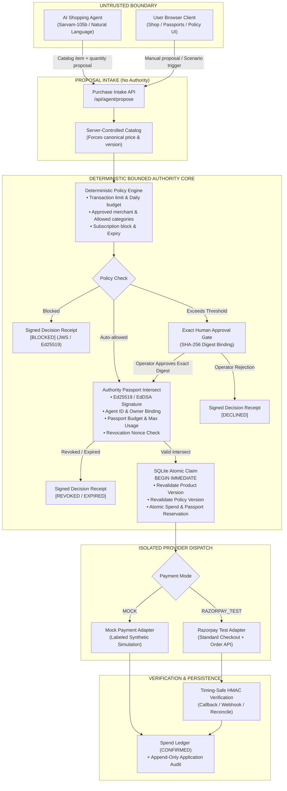

# BoundPay

**Shared spending authority for AI agents, demonstrated on Drunix.** BoundPay lets a model propose a catalog purchase while deterministic services control pricing, policy, human approval, budget reservation, payment dispatch, and outcome verification. An Authority Passport defines an agent's spending limits.

The original Razorpay evaluation build uses one BoundPay service and a local SQLite allowance. The isolated `drunix-shared-authority` upgrade adds a shared mandate: two separately configured services reserve against one allowance on an **actual local Drunix v1.0.0 network**. A purchase is dispatched only after its reservation and dispatch claim have both committed successfully and been read back from the ledger. The recorded two-service demonstration uses **MOCK payments**; it does not move funds.

| Capability | Status in this upgrade |
| --- | --- |
| Local Drunix coordination | Verified on the two-organization sample network; both organizations ran on one developer-controlled Docker host. |
| Two-service budget race | Verified: two INR 2,799 requests competed for INR 5,000; one proceeded and one was blocked. |
| Payment provider | MOCK in the Drunix demonstration. The Razorpay TEST adapter is available but was not exercised for this upgrade. |
| Production or event eligibility | Unverified. No independent organizational governance, NPCI/Citi API access, or CHL-7007 rulebook is claimed. |

Start with [Local setup](#setup) for the original single-service flow or [Shared authority on Drunix](#shared-authority-on-drunix) for the upgrade. [Phase 1 design](docs/DRUNIX_PHASE1_DESIGN.md) records the source review; [Phase 2 implementation](docs/DRUNIX_PHASE2_IMPLEMENTATION.md) records commands and transaction evidence; [submission readiness](docs/DRUNIX_SUBMISSION_READINESS.md) gives the acceptance review, measured local latency, track recommendation, and three-minute script.

## Original single-service architecture

This diagram describes the existing BoundPay evaluation flow. The Drunix extension adds a second, shared reservation and committed dispatch claim before provider dispatch; its state machine and trust boundaries are documented in [Phase 2](docs/DRUNIX_PHASE2_IMPLEMENTATION.md).


```mermaid
flowchart TD
    subgraph Untrusted["UNTRUSTED BOUNDARY"]
        Agent["AI Shopping Agent<br/>(Sarvam-105b / Natural Language)"]
        Browser["User Browser Client<br/>(Shop / Passports / Policy UI)"]
    end

    subgraph Proposal["PROPOSAL INTAKE (No Authority)"]
        Agent -->|Catalog item + quantity proposal| Intake["Purchase Intake API<br/>/api/agent/propose"]
        Browser -->|Manual proposal / Scenario trigger| Intake
        Intake --> CatalogLookup["Server-Controlled Catalog<br/>(Forces canonical price & version)"]
    end

    subgraph DeterministicCore["DETERMINISTIC BOUNDED AUTHORITY CORE"]
        CatalogLookup --> PolicyGate["Deterministic Policy Engine<br/>• Transaction limit & Daily budget<br/>• Approved merchant & Allowed categories<br/>• Subscription block & Expiry"]
        PolicyGate --> DecisionCheck{"Policy Check"}
        
        DecisionCheck -->|Blocked| BlockedReceipt["Signed Decision Receipt<br/>[BLOCKED] (JWS / Ed25519)"]
        DecisionCheck -->|Exceeds Threshold| ApprovalGate["Exact Human Approval Gate<br/>(SHA-256 Digest Binding)"]
        DecisionCheck -->|Auto-allowed| PassportGate
        
        ApprovalGate -->|Operator Rejection| RejectedReceipt["Signed Decision Receipt<br/>[DECLINED]"]
        ApprovalGate -->|Operator Approves Exact Digest| PassportGate["Authority Passport Intersect<br/>• Ed25519 / EdDSA Signature<br/>• Agent ID & Owner Binding<br/>• Passport Budget & Max Usage<br/>• Revocation Nonce Check"]
        
        PassportGate -->|Revoked / Expired| PassportBlocked["Signed Decision Receipt<br/>[REVOKED / EXPIRED]"]
        PassportGate -->|Valid Intersect| ExecClaim["SQLite Atomic Claim<br/>BEGIN IMMEDIATE<br/>• Revalidate Product Version<br/>• Revalidate Policy Version<br/>• Atomic Spend & Passport Reservation"]
    end

    subgraph ProviderBoundary["ISOLATED PROVIDER DISPATCH"]
        ExecClaim --> ProviderRouter{"Payment Mode"}
        ProviderRouter -->|MOCK| MockProvider["Mock Payment Adapter<br/>(Labeled Synthetic Simulation)"]
        ProviderRouter -->|RAZORPAY_TEST| RazorpayProvider["Razorpay Test Adapter<br/>(Standard Checkout + Order API)"]
    end

    subgraph Settlement["VERIFICATION & PERSISTENCE"]
        MockProvider --> Ledger["Spend Ledger (CONFIRMED)<br/>+ Append-Only Application Audit"]
        RazorpayProvider --> WebhookVerify["Timing-Safe HMAC Verification<br/>(Callback / Webhook / Reconcile)"]
        WebhookVerify --> Ledger
    end
```

### Authorization & Execution Lifecycle

| Step | Stage | Authority Rule & Invariant | Output State |
| :---: | :--- | :--- | :--- |
| **1** | **Proposal Intake** | Model or user proposes product & quantity. Server strictly resolves canonical price & version from server catalog. | Proposal Created (`READY` / `NEEDS_APPROVAL`) |
| **2** | **Policy Gate** | Evaluates integer-paise caps, daily budget, merchant allowlist, category, and subscription ban. | Auto-Allowed or Blocked (`BLOCKED`) |
| **3** | **Human Approval** | Required if amount exceeds approval threshold. Bound cryptographically to SHA-256 digest of exact proposal. | Approved Intent (`APPROVED`) |
| **4** | **Passport Gate** | Intersects policy with Ed25519 Authority Passport. Enforces agent bounds, quota, budget, and revocation nonce. | Validated Authority Mandate |
| **5** | **Atomic Claim** | SQLite `BEGIN IMMEDIATE` revalidates catalog & policy versions; locks daily budget and passport allowance atomically. | Intent Claimed (`EXECUTING`) |
| **6** | **Provider Dispatch** | Isolated route to either MOCK adapter or Razorpay TEST gateway (`createOrder`). | Order Created (`ORDER_CREATED`) |
| **7** | **Settlement & Audit** | Timing-safe HMAC callback/webhook verification. Appends to immutable audit trail. | Confirmed Ledger (`PAYMENT_CONFIRMED`) |


## What is implemented


- Server-owned, versioned catalog and spending policy.
- Explicit per-purchase budget and deterministic transaction, category, merchant, subscription, expiry, and daily-budget checks.
- Stale catalog regression guard: durably invalidates proposals if the catalog price or attributes advance before checkout, transitioning to `EXPIRED` and preserving financial isolation.
- Human approval bound to the SHA-256 digest of exact product, quantity, price, budget, policy/catalog versions, owner, merchant, and quote expiry.
- Atomic SQLite `BEGIN IMMEDIATE` reservation before provider dispatch; one ledger row per intent.
- Idempotent intent/order behavior, durable `UNKNOWN` outcomes, receipt/status reconciliation, signed callback and webhook verification, webhook replay handling, and append-only application audit export.
- Clearly separated `FIXTURE`/`LIVE_MODEL` proposal modes and `MOCK`/`RAZORPAY_TEST` payment modes.
- Authenticated scenario controls that modify normal inputs or inject mock faults at adapter boundaries; they never set a final decision.
- Clean, modern enterprise UI across all views (`/shop`, `/login`, `/policy`, `/activity`, `/passports`) featuring refined typography, dark glassmorphism navigation, responsive mobile layouts, and a visual authorization debugger.
- Versioned Authority Passports: immutable Ed25519/EdDSA-signed, owner/agent-bound mandates with durable revocation, explicit merchant/category/amount/budget/usage constraints, and an atomic passport-usage ledger.
- Signed authorization decision receipts for every deterministic outcome, offline verification/proof bundles, and a keyboard-operable visual authorization debugger.

See [Architecture](docs/ARCHITECTURE.md), [Authority Passports](docs/AUTHORITY_PASSPORTS.md), [Passport Threat Model](docs/AUTHORITY_PASSPORT_THREAT_MODEL.md), [Threat Model](docs/THREAT_MODEL.md), [Evaluation](docs/EVALUATION.md), [Phase 4 Report](docs/PHASE_4_REPORT.md), [Razorpay Test Verification](docs/PHASE_4_RAZORPAY_TEST_VERIFICATION.md), [Final Security Verification](docs/FINAL_SECURITY_VERIFICATION.md), and the [Drunix Phase 1 design](docs/DRUNIX_PHASE1_DESIGN.md).

## Requirements & Prerequisites

Also documented in [requirements.txt](requirements.txt) and [package.json](package.json).

| Component | Requirement | Tested Version | Notes |
| :--- | :--- | :--- | :--- |
| **Node.js** | `>= 20.0.0` (LTS) | `v20.20.2` | Core JavaScript runtime |
| **Package Manager** | `pnpm >= 10.0.0` | `10.33.0` | Dependency resolution via `pnpm-lock.yaml` |
| **Database** | SQLite 3 with WAL support | `better-sqlite3 11.8.1` | Local persistent file storage (`DATABASE_PATH`) |
| **Operating System** | Linux, macOS, or Windows (WSL2) | Ubuntu Linux x64 | Requires POSIX-compliant filesystem for SQLite locks |
| **Browser Engine** | Chromium | Installed via Playwright | Required for running `pnpm run test:e2e` |
| **Cryptography** | Node `crypto` + `jose 6.2` | Built-in / `jose 6.2.11` | Ed25519 / EdDSA Authority Passport signatures |
| **Live Model (Optional)** | `SARVAM_API_KEY` | `sarvam-105b` | Required only when `AGENT_MODE=live` (offline fixtures require no key) |
| **Payment Gateway (Optional)** | `RAZORPAY_KEY_ID`, `_SECRET` | TEST mode (`rzp_test_*`) | Required only when `PAYMENT_ADAPTER_MODE=RAZORPAY_TEST` |

## Setup

```bash
cp .env.example .env
pnpm install --frozen-lockfile
pnpm run authority:keys
pnpm run db:migrate
pnpm run db:seed
pnpm run dev
```

The CLI commands load `.env.local` before `.env`, while explicit process environment values take precedence. Generate the ignored local signing keys **before** seeding; otherwise development seeding completes without an Authority Passport. `pnpm run authority:validate` checks the configured key. Open `http://localhost:3000`. Local seed credentials are `operator` / `BoundPayPass123!`; replace `OPERATOR_INITIAL_PASSWORD` and `SESSION_SECRET` before any shared deployment.

Important environment values:

- `DATABASE_PATH`: persistent SQLite file path.
- `AGENT_MODE=fixture|live`; live requires `SARVAM_API_KEY` (model `sarvam-105b` via `/v1/chat/completions`) or optional `OPENAI_API_KEY`.
- `PAYMENT_ADAPTER_MODE=MOCK|RAZORPAY_TEST`; Razorpay TEST requires test key ID/secret and webhook secret. `rzp_live_` keys are rejected.
- `QUOTE_VALIDITY_SECONDS`: exact-intent quote lifetime.
- `AUTHORITY_SIGNING_PRIVATE_KEY` / `_FILE`: server-only Ed25519 PKCS#8 signing key. `AUTHORITY_SIGNING_PUBLIC_KEY` / `_FILE`, `AUTHORITY_SIGNING_KEY_ID`, `AUTHORITY_ISSUER`, and `AUTHORITY_AUDIENCE` are required for a configured non-test authority. Use `pnpm run authority:keys` for local files under ignored `.authority/`; never commit or log them.
- `AUTHORITY_VERIFICATION_KEYS_JSON`: optional `kid` → public-key map for verification-key rotation. Unknown key IDs and unsupported algorithms fail closed. `AUTHORITY_TEST_MODE=true` is deterministic and test-only.

Live mode never silently falls back to fixtures. Existing intents retain the adapter mode they were created with.

## Demo

Use the “Authenticated demo scenario runner” on Shop and follow [docs/DEMO_SCRIPT.md](docs/DEMO_SCRIPT.md). Reset first for a predictable local demo:

```bash
CONFIRM_RESET=true pnpm run db:reset
pnpm run build
pnpm start
```

A genuine Razorpay TEST demonstration still requires the operator to supply credentials, configure a reachable signed webhook, complete Checkout, and capture matching dashboard evidence. Do not present a mock confirmation as that evidence.

## Verification commands and historical evaluation evidence

```bash
pnpm run typecheck
pnpm run lint
pnpm test
pnpm run test:deterministic
pnpm run test:state
pnpm run test:e2e
pnpm run build
pnpm run eval:latency
pnpm audit --prod
pnpm run authority:validate
pnpm run security:public-artifacts
```

Historical verification for release tag `boundpay-buildathon-final` (the original Razorpay evaluation build; see [Shared authority on Drunix](#shared-authority-on-drunix) for current upgrade results):
- **Vitest**: **338/338 tests passed** across 29 files, covering Authority Passports, Ed25519/EdDSA crypto, deterministic policy evaluation, worker-process SQLite concurrency/locking, schema migrations, and stale historical-catalog regression guards.
- **Playwright E2E**: **18/18 Chromium tests passed** across all user scenarios, unauthenticated route protection, operator login, human approval flows, Visual Authorization Debugger inspection, receipt verification, and passport lifecycle.
- **TypeScript**: `tsc --noEmit` passed with 0 errors.
- **ESLint**: `next lint` passed with 0 warnings and 0 errors.
- **Public Secret Exposure**: `pnpm run security:public-artifacts` scanned 94 static/server client-facing build artifacts and confirmed 0 private keys, secrets, or tokens exposed.
- **Fresh Clone Verification**: Documented setup (`cp .env.example .env`, `pnpm install`, `pnpm run db:migrate`, `pnpm run db:seed`, `pnpm run build`) verified clean from an isolated clone.

Live model evaluation (Sarvam AI sarvam-105b): 20/20 executed, 0 skipped. Strict JSON Schema output verified with Zod business validation. 19/20 requests satisfied, 2 proposed policy violations (subscriptions) both strictly blocked by the deterministic policy gate, 0 unexpected payment provider order calls, median latency 6929 ms.

Real Razorpay TEST verification: Phase 4 completed full end-to-end verification with test credentials (live Sarvam proposal, exact human approval, order `order_TYFC3NA5M8g7qI`, payment `pay_TYFqxNNBrbJRas`, ₹2,799 captured, 1 confirmed ledger row, timing-safe HMAC signature verified, authoritative provider lookup confirmed). Razorpay Test Dashboard record confirmed by operator. See [docs/PHASE_4_RAZORPAY_TEST_VERIFICATION.md](docs/PHASE_4_RAZORPAY_TEST_VERIFICATION.md) and [docs/FINAL_SECURITY_VERIFICATION.md](docs/FINAL_SECURITY_VERIFICATION.md).

## Original single-service deployment preparation

Build with `pnpm run build` and run with `pnpm start`. For the original SQLite-only flow, deploy exactly one application instance with a persistent volume mounted at `DATABASE_PATH`; its local allowance is not a shared multi-instance design. The Drunix demo uses two separately configured service instances with distinct SQLite files and ledger identities, as described below. Use HTTPS, strong environment-only secrets, `Secure` cookies (`NODE_ENV=production`), and a public HTTPS Razorpay webhook URL when exercising TEST payments. Run migrations before start and back up persistent data. Re-run auth, webhook, payment, and browser smoke tests in any deployed environment.

No deployment or publication is performed by repository scripts.

## Authority Passport quick start

The `/passports` view issues and revokes owner-bound passports. Each new intent selects exactly one ACTIVE passport; omitted passport IDs in legacy Phase 3 service calls resolve to the seeded OfficeBot demo passport for compatibility. Passport constraints only intersect with (and can never widen) the current server policy. `UNKNOWN`, `COMMITTED`, and `CONFIRMED` usage rows continue consuming the passport budget and usage allowance; only a definite provider rejection releases a reservation.

Decision receipts are signed EdDSA compact JWS statements, not payment receipts and not execution capabilities. `/api/intents/:id/proof` downloads a sanitized receipt/passport/JWK/fingerprint bundle. Offline verification proves that the configured BoundPay authority signed unchanged contents; it does not prove database completeness, host integrity, or bank settlement. See [docs/AUTHORITY_PASSPORTS.md](docs/AUTHORITY_PASSPORTS.md) and [docs/DEMO_SCRIPT.md](docs/DEMO_SCRIPT.md).

## Shared authority on Drunix

The upgrade adds a Go chaincode contract, an experimentally compatible Node Gateway client, a shared Passport-bound mandate, a recovery outbox, and a `/shared-authority` view. The contract checks participant identity, mandate terms, remaining allowance, reservation uniqueness, revocation, and outcome permissions. BoundPay also applies its existing deterministic policy and exact local approval gate. A direct chaincode caller with participant credentials can bypass those *application-only* gates, so participant deployments remain part of the trust boundary.

| Event | Shared behavior |
| --- | --- |
| Issue | The Passport issuer creates one mandate no broader than the signed Passport, with named participants and outcome verifiers. |
| Reserve | Each participant reserves an intent against the same atomic allowance. Conflicting ledger commits cannot both consume the remaining budget. |
| Dispatch | The executor waits for a `VALID` reservation commit and readback, then a `VALID` one-time dispatch-claim commit and readback before calling its payment adapter. |
| Resolve | A named verifier records a success or definitive failure. An unknown provider result retains the reservation until reconciliation. |
| Revoke | A committed revocation blocks new reservations. Existing reservations and dispatched payments still require resolution. |

The local demo runs **real Drunix ledger transactions** with Org1 and Org2 credentials and **synthetic MOCK payment outcomes**. It does not demonstrate independent organizational governance or real payment settlement. `SHARED_AUTHORITY_MODE=DRUNIX` is the only network-backed shared mode; an outage or failed commit blocks dispatch. `SHARED_AUTHORITY_MODE=SIMULATED` is a visible, non-dispatching label and is never used as a silent fallback. Payment mode remains explicit (`MOCK` or `RAZORPAY_TEST`).

### Reproduce the two-service mock-payment demo

Use Drunix `v1.0.0` and the pinned toolchain, images, identity paths, environment variables, and deployment commands in the [Phase 2 runbook](docs/DRUNIX_PHASE2_IMPLEMENTATION.md#drunix-source-versions-and-deployment). Once the sample network and `boundpay-shared-authority` chaincode are deployed, run:

```bash
pnpm install --frozen-lockfile
pnpm run build
pnpm run shared-authority:drunix-demo
pnpm run shared-authority:drunix-app-demo
```

The app demo starts two production-mode BoundPay processes with distinct sample-network identities and SQLite files. It exercises a competing purchase, service restart, provider timeout, reconciliation, and a pre-dispatch ledger outage. The mock adapter is labeled in the UI; `/shared-authority` shows allowance, reserved and settled totals, revocation, payment state, and ledger confirmation. `UNKNOWN` means the reservation remains held; a timeout alone never releases it. The runbook also gives network cleanup steps. Do not use this demo as evidence of a Razorpay TEST transaction or a bank transfer.

Set `DRUNIX_DEMO_REVIEW_SECONDS=90` to hold the two local dashboards open after the run. Set `DRUNIX_DEMO_AMBIGUOUS_FAULT=SIMULATE_RESPONSE_LOSS` for a second mock scenario in which an order is created before its response is lost; restart still blocks redispatch and retains the hold. The test services use separate application signing keys and share public verification keys, while the sample outcome-verifier credential remains available to both services. The direct contract demo also supports `node scripts/drunix-shared-authority-demo.mjs --inspect-mandate <id>` for a named verifier to read back committed evidence.

### Verification and scope

On this upgrade branch, `pnpm test` passed **343/343** tests across 31 files; a clean source snapshot passed frozen-lockfile installation, migration, seed, signing-config validation, type checking, linting and build on 2026-09-27. The fresh `boundpay-review` channel accepted chaincode version `1.2`, lifecycle sequence `1`, with Org1/Org2 approvals; real network demos passed against it. The [submission review](docs/DRUNIX_SUBMISSION_READINESS.md#measured-local-result) reports nine observed successful reserve timings across three local runs. The Phase 2 record includes actual transaction IDs. The migration test uses a synthetic historical-schema fixture, so a fresh checkout does not need an ignored developer SQLite database.

Drunix v1.0.0's official repository does not establish a supported external TypeScript SDK or a client compatibility guarantee; the Gateway client is an observed local integration. Chaincode does not enforce Passport wall-clock expiry or prove that a human approved the local intent. A verifier attests to a payment outcome; Drunix does not independently prove settlement. Razorpay TEST was not used in the Drunix run, and no exactly-once provider execution is claimed. An official CHL-7007 rulebook, reuse eligibility, API access, submission stages, and final deadline remain unverified. See [Phase 2 limitations](docs/DRUNIX_PHASE2_IMPLEMENTATION.md#acceptance-checklist-and-remaining-limitations) before extending this beyond the local demo.

Among the publicly listed tracks, **Real-Time Payments** is the strongest evidenced fit because the upgrade coordinates pre-dispatch authority and uncertain payment outcomes. It does not implement a payment rail. The user-provided “Innovative Fintech Ideas” / `CHL-7007` label remains unverified in accessible event material; if the organizer portal offers that track, confirm its rules before selecting it. This build does not claim asset tokenization, cross-border remittances, or financial inclusion features.

Project constraints for this proposal:

- Describe a distinctive contribution only with dated evidence against related work; do not claim “first” or “unique” without substantiation.
- Separate user-provided challenge labels from publicly verified event tracks. Do not claim project-reuse eligibility, API access, or NPCI/Citi affiliation without confirmation.
- Make compilation and execution reproducible by pinning source revisions, container digests and tool versions, and recording exact clean-run commands and results.
- Label design, mocks, local test-network results, payment TEST evidence and real payment integrations accurately. A Drunix design or test-network run does not imply a production network or payment-rail integration.

## Limitations

- The original evaluation flow supports one operator, one approved merchant, one currency, and one application instance; the Drunix sample demonstrates two configured instances under one developer-controlled host.
- No claim of power-loss or storage-corruption durability.
- The audit is append-only through the application, not tamper-proof against a database administrator.
- The policy gate constrains explicit attributes; a model can still make an undesirable choice that technically satisfies policy.
- The historical live-model set is small and was not rerun for this Drunix upgrade; it cannot establish general prompt-injection immunity.
- Browser automation does not complete third-party Razorpay Checkout.
- The original authority signs with one issuer key; the local Drunix sample's two identities do not establish independent issuer or network governance.
