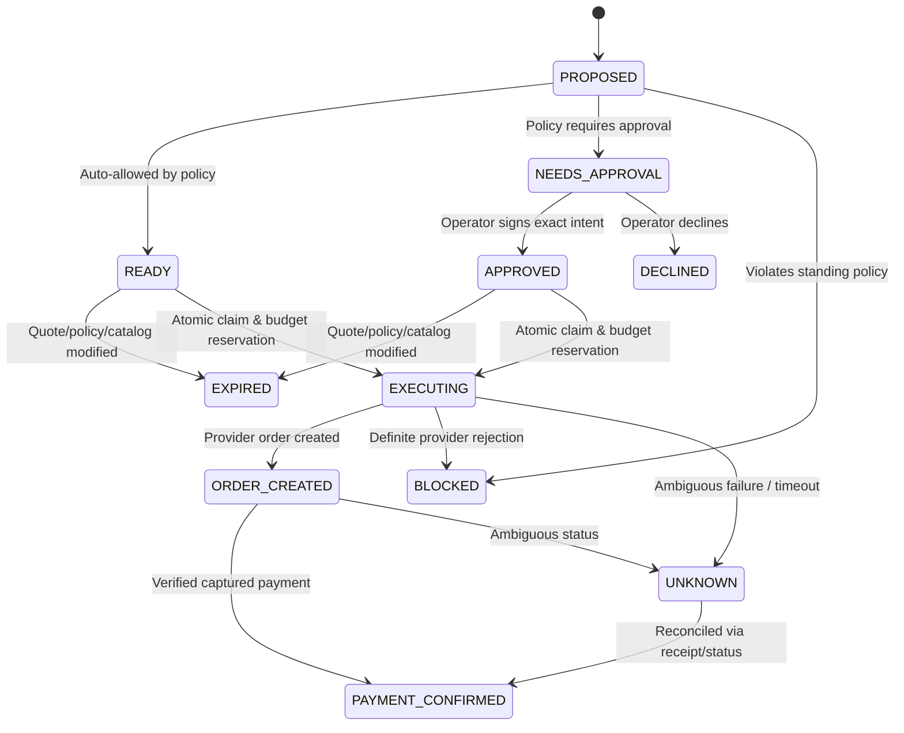

# BOUNDPay Persistent Specification (Phase 1 & Phase 2)
**Project**: BoundPay – Bounded Financial Authority for Agentic Commerce  
**Track**: Razorpay AI Growth & Agentic Commerce Buildathon  
**Phase**: Phase 2 (Live Model Proposals, Razorpay TEST Standard Checkout, Webhooks & Bounded Financial Authority)  
**Status**: Authoritative Reference Document

---

## 1. Executive Summary & Product Scope

### 1.1 Goal
BoundPay decouples shopping proposal intelligence from financial authorization. In autonomous and agentic commerce, an AI shopping agent may propose purchases based on conversational requests. BoundPay ensures that financial authority remains deterministic, strictly bounded, and subject to server-enforced rules and human oversight.

### 1.2 Phase 1 Implemented Scope (Preserved)
- **Single Operator Account**: Authenticated operator session with password hashing (`bcryptjs`), HttpOnly cookies, SameSite enforcement, session expiry, and login rate limiting.
- **Single Merchant**: Configured approved merchant (`demo_store`).
- **Currency**: `INR` only.
- **Monetary Unit**: Integer paise only (₹1 = 100 paise; e.g., ₹2,799 = 279900 paise). Zero floating-point rupee arithmetic.
- **Catalog Management**: Server-controlled, persistent, editable catalog with versioning. Shipping and tax are included in total catalog prices.
- **Spending Policy Engine**: Persistent, editable spending policy with versioning.
  - Default maximum transaction: 400,000 paise (₹4,000).
  - Default daily budget: 500,000 paise (₹5,000).
  - Default approval threshold: 250,000 paise (₹2,500).
  - Default allowed categories: `electronics`, `books`.
  - Subscriptions: Prohibited (`allow_subscriptions: false`).
- **Explicit Purchase Budget**: Required numeric UI field specifying the maximum spend authorized for the specific purchase request:
  $$\text{effective\_limit} = \min(\text{policy.max\_transaction\_amount\_paise}, \text{purchase\_budget\_paise})$$
- **Exact-Intent Human Approval**: Cryptographically bound to canonical SHA-256 digest of authorization fields. Any change in catalog price, quantity, category, or policy invalidates prior approvals.
- **Transaction-Safe Budget Reservations**: SQLite atomic transactions (`BEGIN IMMEDIATE`) verify available daily budget, insert ledger reservations, and transition intent state to `EXECUTING` before calling payment adapters.
- **Idempotency**: Scoped uniqueness on `(owner_id, idempotency_key, payment_adapter_mode)`.
- **Append-Only Audit Trail**: Immutable log of every proposal, policy evaluation, state transition, approval, reservation, and payment outcome.

### 1.3 Phase 2 Implemented Scope (Added)
- **Live AI Shopping Agent Integration**:
  - Official OpenAI SDK integration (`openai@^4.0.0` or `openai@^7.0.0`).
  - Configurable model (defaults to `gpt-4o-mini`).
  - Strict JSON output schema (`product_id`, `quantity`, `reason`, or structured `suitable: false`).
  - Catalog descriptions explicitly marked as untrusted text to defend against prompt injection.
  - Model outputs cannot grant approval, alter policy, or determine prices.
  - Dual-mode operation: `AGENT_MODE=fixture` (deterministic local keywords) and `AGENT_MODE=live` (OpenAI API).
- **Razorpay TEST Payment Gateway Integration**:
  - Strict safety guard: Hard rejection of live keys (`rzp_live_...`).
  - Orders API: Creates server-side Razorpay test order with integer paise, currency `INR`, stable `receipt`, and `notes: { intent_id }`.
  - Razorpay Standard Checkout: Client-side integration using official `https://checkout.razorpay.com/v1/checkout.js`.
  - Verification & Capture: Server verifies HMAC-SHA256 signature (`order_id + "|" + payment_id`) using timing-safe comparison, queries Razorpay Payments API, and confirms payment only when `status === 'captured'`.
  - Dedicated Webhooks: `/api/webhooks/razorpay` verifies HMAC signature on exact raw request body, enforces 1MB payload limits, deduplicates `(provider, event_id)` in `webhook_events`, handles callback/webhook races, and durably retains unmatched events.
  - Provider Status Refresh: `/api/intents/[id]/refresh-status` queries Razorpay for orders where browser callback was missed.
  - Crash Recovery: Recovers stale executing intents without creating duplicate orders.

---

## 2. Trust Boundaries & Security Model

```
       [ Untrusted Client / Browser / LLM ]
                          │
                          ▼ (shopping_request, explicit purchase_budget)
    ═══════════════════════╪══════════════════════════════════════════════
    BOUNDPAY TRUST BOUNDARY│ (Server-Side Deterministic Authority)
                          ▼
            [ 1. AI Shopping Agent Proposal ]
            (Model selects catalog item; untrusted text sanitized)
                          │
                          ▼
            [ 2. Catalog Attribute Resolution ]
            (Price, Category, Subscription status, Merchant, Version)
                          │
                          ▼
            [ 3. Deterministic Policy Engine ]
            (Limits, Categories, Subscriptions, Merchant, Expiry)
                          │
                          ▼
            [ 4. Exact Intent & Approval Authority ]
            (Canonical SHA-256 Digest & Human Signature if > threshold)
                          │
                          ▼
            [ 5. Atomic Ledger & Budget Reservation ]
            (SQLite Serialized Transaction: Spend Invariant Check)
                          │
                          ▼
            [ 6. Payment Adapter Dispatch ]
            (MOCK: auto-confirm; RAZORPAY_TEST: Orders API -> ORDER_CREATED)
                          │
                          ▼
            [ 7. Human-Completed Provider Checkout ]
            (Razorpay Standard Checkout Modal in Browser)
                          │
                          ▼
            [ 8. Server Verification & Confirmation ]
            (HMAC-SHA256 Signature Verification + Razorpay Payments API)
                          │
                          ▼
            [ 9. Append-Only Audit Trail ]
```

### 2.1 Untrusted Components
1. **The Model**: Untrusted. The model is permitted to supply only:
   - `product_id`: A string matching an existing catalog product.
   - `quantity`: An integer between 1 and 10.
   - `reason`: A short explanation string.
   - Or `suitable: false` with explanation.
   The model **never** receives credentials, tokens, or tools to execute payments or modify policy.
2. **Product Descriptions**: Third-party untrusted text. Quoted in prompt with clear boundaries so model ignores embedded prompt injections.
3. **The Browser / Client**: Untrusted. Cannot dictate pricing, state, or signature validity.

---

## 3. Payment Gateway Lifecycle & State Machine



---

## 4. Test Matrix & Verification Coverage

| Test Area | Suite | Tests | Status |
| :--- | :--- | :--- | :--- |
| **Domain Logic** | Money, Catalog, Policy, State Machine | 38 | Passed |
| **Storage & Invariants** | SQLite Schema, Immediate Tx, Concurrency | 12 | Passed |
| **Authentication** | Passwords, Sessions, Rate Limiting, HTTP Guards | 27 | Passed |
| **AI Shopping Agent** | Schema, Sanitize, Prompt Injection, Errors | 17 | Passed |
| **Razorpay Adapter** | Contract, Order Payload, Error Mapping | 12 | Passed |
| **Signatures** | Checkout HMAC, Webhook HMAC, Whitespace | 10 | Passed |
| **Checkout & Webhooks** | Callback, Webhook dedup, Status refresh, Recovery | 6 | Passed |
| **Security & Auth** | HTTP guards, Cross-owner, Forgery defense | 7 | Passed |
| **Playwright E2E** | 10 Full-browser Operator & Agent Workflows | 10 | Passed |
| **Total Automated Tests** | **All 13 Suites** | **139** | **100% Passed** |
